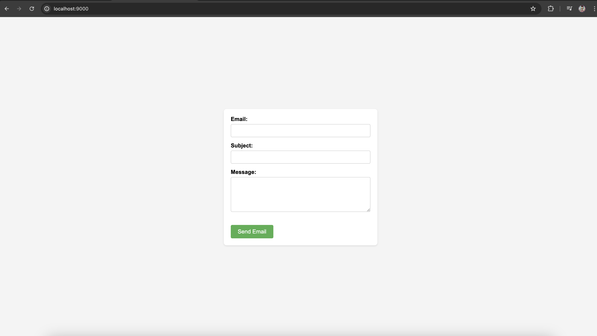
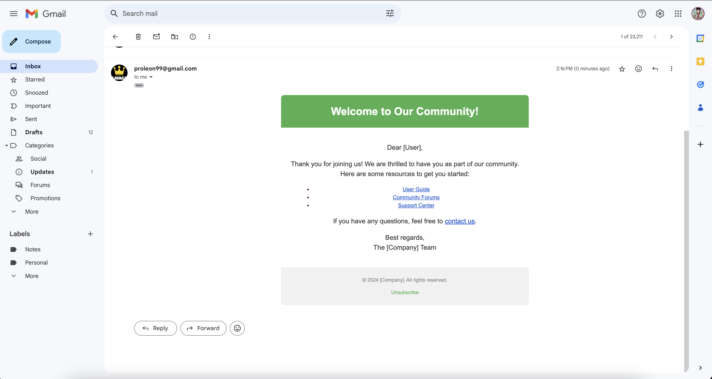

# Email Sending Application Using Gmail

This project is a simple Node.js application that allows users to send emails via a web form using Gmail's SMTP server. It uses Express for the server and Nodemailer for handling email sending.

## Screeshort

1. `Local Host` (Email sending Form)



2. `Gmail` (Mail Recived in Gmail)



## Features

- User-friendly web form for sending emails
- Securely sends emails using Gmail's SMTP server
- Handles both plain text and HTML email content

## Prerequisites

- Node.js and npm installed on your machine
- A Gmail account for sending emails

## Setup

1. Clone the repository to your local machine:

   ```bash
   git clone https://github.com/Lovenoelkujur/mail-send-app-using-gmail.git
   cd email-sending-app
   ```

2. Install the required dependencies:

    ```bash
    npm install
    ```

3. Create a `.env` file in the root of the project and add your Gmail credentials:

    ```bash
    EMAIL_USERNAME=your-email@gmail.com
    EMAIL_PASSWORD=your-email-password
    ```

    Note: For security reasons, it is recommended to use an `App Password` instead of your actual email password.

4. Start the server:

    ```bash
    npm start
    ```

5. Open your web browser and navigate to` http://localhost:9000` to access the email form.

## Usage

1. Fill in the email form with the recipient's email address, subject, and message.

2. Click `"Send Email"` to send the email.

3. The server will send the email using the configured Gmail account and display a success or error message.

## Project Structure

- `index.js`: Main server file containing all the logic for handling email sending.

- `package.json`: Contains project metadata and dependencies.

- `.env`: Environment variables file (not included in the repository for security reasons).

## Dependencies

```bash
    {
        "dotenv": "^16.4.5",
        "express": "^4.19.2",
        "nodemailer": "^6.9.13"
    }
```

- `Express`: Fast, unopinionated, minimalist web framework for Node.js.

- `Nodemailer`: Module for Node.js applications to allow easy email sending.

- `dotenv`: Module to load environmentvariables from a .env file.

## Security Considerations

* Never expose your email credentials directly in the code. Use environment variables or secure secret management services.

* Use Gmail's App Passwords instead of your main account password for added security.

## Troubleshooting

* `Error sending email`: Invalid login: Ensure that you have provided the correct Gmail credentials and that you have enabled "Less secure app access" in your Google account settings, if using a regular password.

* `Server not starting`: Ensure that you have installed all dependencies by running `npm install`.

## License

This project is licensed under the MIT License. See the LICENSE file for details.